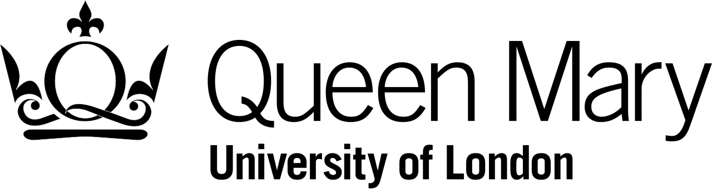
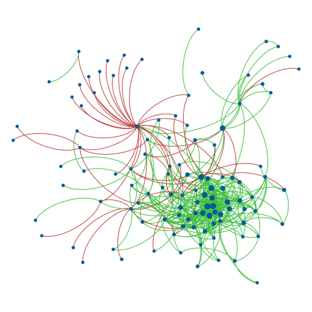
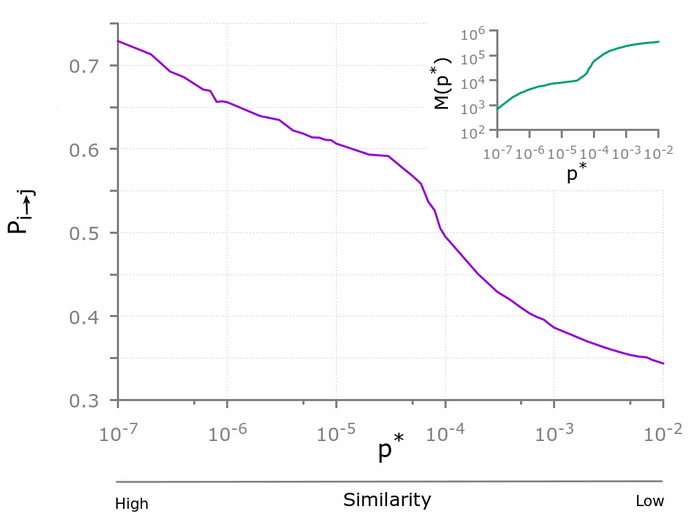
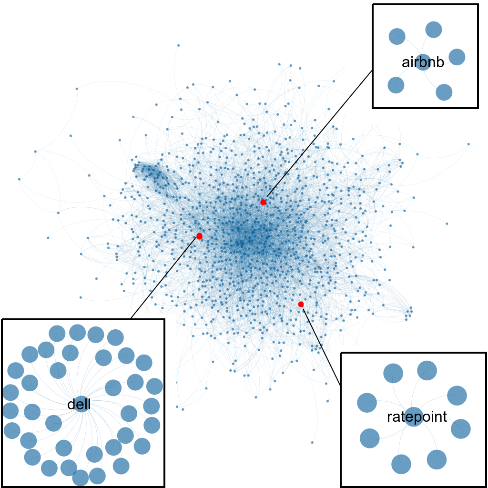

## **Education**

### **Doctor of Philosophy (Ph.D.) in Applied Mathematics (2013 - 2017)**

 <table align='left' width: 800px>
  <col align="left">
  <tr>
    <th></th>
  </tr>
</table>

My research was broadly concerned with collaborative social networks, the antecedents and consequences of group formation, and social capital. I am interested primarily in uncovering the network mechanisms that are responsible for forging, maintaining, and severing social relationships among individuals over time. I am interested in the structural foundations of economic performance, scientific success, and artistic creativity. In particular, some of my ongoing projects are aimed at investigating:

-  how disciplinary similarity among scientists affects co-authorship patterns in scientific production;

- the structural determinants of the success of start-up companies based on the quality of their professional teams and their connections with one another, using multi-layered and interconnected network approach.

In all my projects I use novel techniques of complex network analysis and develop scalable software for the analysis of very large data set.

### [Thesis: Positive and negative connections and homophily in complex networks](https://qmro.qmul.ac.uk/xmlui/bitstream/handle/123456789/31787/CIOTTI_Valerio_PhD_final_170118.pdf?sequence=1)

In this thesis I investigate the effects of positive and negative connections on social and organization networks, and the presence and role ofhomophily in networks of scientific collaborations and citations through the  combination  of  methodologies  borrowed  from  complexity  science, statistics, and organizational sciences. In the first part of the thesis, I study the differences between patternsof  positive  and  negative  connections  among  individuals  in  two  onlinesigned social networks.  Findings suggest that the sign of links in a socialnetwork  shapes  differently  the  network’s  topology:  there  is  a  positive correlation between the degrees of two nodes, when they share a positive connection, and a negative correlation when they share a negative connection.

I then move my focus to the study of a dataset on start-ups from which I construct and analyse the competition and mobility networks amongcompanies. Results show that the presence of competition has negativeeffects on the mobility of people among companies and on the success of the start-up ecosystem of a nation.

Competitive behaviours may also emerge in science. Therefore, in the second part of this thesis, I focus on a database of all papers and authorswho have published in the American Physical Society (APS) journals. Through  the  analysis  of  the  citation  network  of  the  APS,  I  propose  a method that aims to statistically validate the presence (or absence) of a citation between any two articles.  Results show that homophily is an important mechanism behind the citation between articles: the more two articles share similar bibliographies, i.e., deal with similar arguments, the more likely there is a citation between them.

In the last chapter, I investigate the presence of homophily in the APS data set, this time at the level of the collaboration network among scientists. Results  show  that  homophily  can  be  responsible  in  fostering collaboration, but above a given point the effect of similarity decreases the probability of a collaboration.  Additionally, I propose a model that successfully reproduces the empirical findings.

[Positive and negative connections and homophily in complex networks](https://qmro.qmul.ac.uk/xmlui/bitstream/handle/123456789/31787/CIOTTI_Valerio_PhD_final_170118.pdf?sequence=1)

------

### **MSc in Theoretical Physics (2010 - 2013)**

  <table align='left' width: 800px>
<col align="left">
  <tr>
    <th></th>
  </tr>
</table>

During my master I focused on different area of modern physics, namely:

- Complex systems (Master thesis: "Degree correlation in complex social networks")
- Statistical mechanics (critical phenomena, disordered systems, neural networks)
- Mathematical methods and modelling (numerical methods for physics, stochastic processes, rational mechanics)
- Quantum Relativistic Mechanics

### **BSc in Physics (2007 - 2010)**

   <table align='left' width: 800px>
<col align="left">
  <tr>
    <th></th>
  </tr>
</table>

-------------------------

## Scientific Published Papers

### [Sentiment Analysis using Network Topology]()

I have studied signed social networks, i.e., networks in which social relationships can have a positive (e.g., collaboration, friendship, trust) or a negative (e.g., competition, enmity, distrust) connotation.  In the complex network domain, relatively little attention has been devoted to the emergence of the association between global structural properties and the sign of the connection, chiefly because negative networks are difficult to collect and analyse. As a result, a number of question, still remain relatively unexplored. For example, do individuals who like (dislike) many others tend to like (dislike) each other, or do they like (dislike) those who like (dislike) only very few others? To address this problem, I have analysed two large data sets of two online social networks in which individuals express their trust (friendship) or distrust (enmity) towards each other. The results I have obtained help clarify the role of the sign of links.

### [Did you remember to cite?]()

Citation networks have been widely used to study the evolution of science through the lenses of the underlying patterns of knowledge flows among academic papers, authors, research sub-fields,  and scientific journals. In this paper, we focus on citation networks to cast light on the salience of homophily, namely the principle that similarity breeds connection, forhomophily knowledge transfer between papers. We propose a novel method for measuring the similarity between articles through the statistical validation of the overlap between their bibliographies. Results suggest that the probability of a citation made by one article to another is indeed an increasing function of the similarity between the two articles. Our study also enables us to uncover missing citations between pairs of highly related articles, and may thus help identify barriers to effective knowledge flows. By quantifying the proportion of missing citations, we conduct a comparative assessment of distinct journals and research sub-fields in terms of their ability to facilitate or impede the dissemination of knowledge. Our study has important implications for authors, editors and reviewers of scientific journals, as well as public preprint repositories, as it provides a procedure for recommending relevant yet missing references and properly integrating bibliographies of papers.

### [Predicting successful startups]()

By drawing on large-scale online data we were able to construct and analyze the time-varying worldwide network of professional relationships among start-ups. The nodes of this network represent companies, while the links model the flow of employees and the associated transfer of know-how across companies. We used network centrality measures to assess, at an early stage, the likelihood of the long-term positive economic performance of a start-up.
 
 We found that the start-up network has predictive power and that by using network centrality we can provide valuable recommendations, sometimes doubling the current state of the art performance of venture capital funds. Our network-based approach supports the theory that the position of a start-up within its ecosystem is relevant for its future success, while at the same time it offers an effective complement to the labour-intensive screening processes of venture capital firms. Our results can also enable policy-makers and entrepreneurs to conduct a more objective assessment of the long-term potentials of innovation ecosystems, and to target their interventions accordingly.

-------------------------

## Scientific Publications

  - [[1](https://www.sciencedirect.com/science/article/pii/S0378437114010334)] V. Ciotti, G. Bianconi, A. Capocci, F. Colaiori, and P. Panzarasa (2015). [Degree correlations in signed social networks](https://www.sciencedirect.com/science/article/pii/S0378437114010334). Physica A: Statistical Mechanics and its Applications 422: 25-39 

  - [[2](https://epjdatascience.springeropen.com/articles/10.1140/epjds/s13688-016-0068-2)] V. Ciotti, M. Bonaventura, V. Nicosia, P. Panzarasa, V. Latora (2015). [Homophily and missing links in citation networks](https://epjdatascience.springeropen.com/articles/10.1140/epjds/s13688-016-0068-2). EPJ Data Science, 5(1), 1-14 

  - [[3](https://www.nature.com/articles/s41598-019-57209-w.pdf)] M. Bonaventura, V. Ciotti, P. Panzarasa, S. Liverani, L. Lacasa, V. Latora (2020). [Predicting success in the worldwide start-up network](https://www.nature.com/articles/s41598-019-57209-w.pdf) Scientific reports 10 (1), 1-6 

    
-------------------------
## [List of Talks and Posters]()

We may have met one another somewhere. [Here]() is the list of talks that I gave and posters that I presented.
