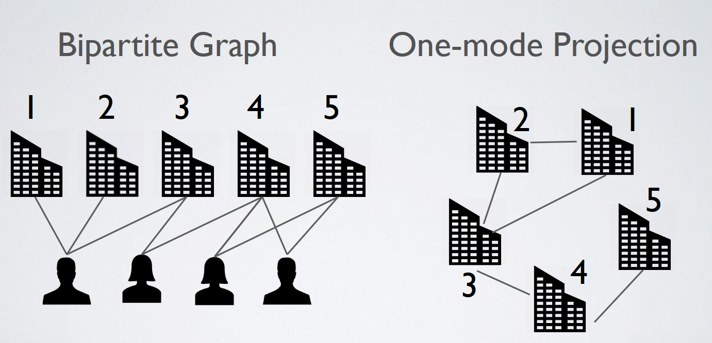
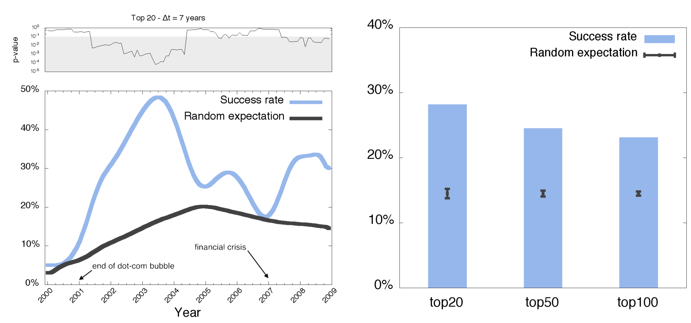

The Italian translation of the common English saying “a friend is worth his weight in gold” is “who finds a friend, discovers a treasure”. In the startup ecosystem we can venture that “who finds the right team, discovers a unicorn”.

For early stage startups, a key source of success lies in its team.These people will have the responsibilities to develop and transform what is only an idea into a tangible product or asset. This may sound trivial, however the problem of quantifying the qualities that an employee has is one of the hardest challenges for its ethereal nature. Being able to quantitatively represent the benefits that an employee can bring into a startup constitutes a key feature in predicting which early stage startup will be more likely to succeed in the near future.

Predicting the success of an early-stage company is a difficult challenge as the most commonly adopted models of business evaluation are based on historical trends of data such as sales, cash flow, production capacity and internal growth. However, these indicators are difficult to apply to early-stage companies because of their limited history, small (if any) revenue, operating losses, and often their reliance on private equity. 

To tackle this problem, during our PhD at the Queen Mary University of London, Dr. Bonaventura and I analysed 41,830 companies across 117 different countries over the course of 25 years, from 1990 to 2015. The idea behind our approach was to promote a methodology ranking companies based on the core components of their team members. To this end, we constructed and analysed the worldwide network of professional relationships among start-ups. We first constructed a bipartite graph in which people are only connected to start-ups according to their professional role. We then obtained the projected one-mode time-varying graph in which start-ups are the nodes and two companies are connected when they share at least one individual that plays or has played a professional role in both companies. Such network provides the backbone and the channels through which knowledge can be gained, transferred, shared, and recombined. For instance, skilled employees moving across firms in search of novel opportunities can bring with them know-how on cutting-edge technologies. 

We can imagine the network of startups evolving over time, i.e. new companies and connections are forged over time as people move from one company to another. To test if we are able to highlight a set of successful companies from this network, we simulated a decision process every historical month. For every monthly snapshot of the network, we consider only those companies that existed at that point in time. We rank companies based on their closeness centrality, a network measure that quantifies how well connected a node in the network based on its average distance from all the other nodes. From this ranking we keep all early-stage companies only, i.e. those companies that are less than 2 years old, that did not receive any form of funding, and that have not reached any form of success. Every month, we evaluate a selection policy based on the top 20 early-stage companies and the fraction of which reached a successful outcome within 7 years from the ranking date. By a successful outcome here we mean the achievement of at least one of the following: being acquired, acquiring another company, going public via an IPO.

Results are very promising: if we blindly invested in 20 random early-stage companies, we would end up with an average success rate of circa 10%. However, if we invested in the top 20 companies suggested by the methodology developed, we would have on average a success rate of circa 30%.

The method presented in our paper provides a simple heuristic recommendation, i.e. it does not quantify the probability of each start-up in the early-stage company list showing economic success in the future. Our recommendation method can help stakeholders devise and fine-tune a number of effective strategies, simply based on the underlying network. Moreover, it will help venture capitalists save time in the process of screening and evaluating companies, which is often a subjective and labour intensive task fraught with biases and uncertainties. 

Finally, let us note that this work is intended to elucidate the role that network mechanisms might play in sustaining success, rather than to provide more sophisticated yet non-interpretable prediction algorithms. More work should be carried out to fully investigate network-based predictability of economic success.

The work has been supported and funded by startup-network.org, an Italian company that provides software-as-a-service solutions to private investors, venture firms, and accelerators.
